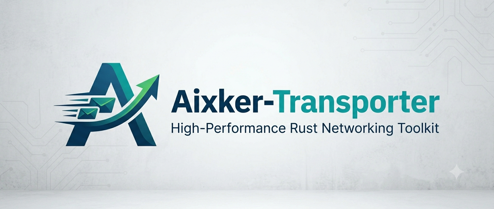

# Aixker-Transporter



Aixker-Transporter is a high-performance Rust toolkit that provides  
**CLI utilities for network transport**, including:

- **Multicast sender & listener**
- **QUIC client & server**
- **Automatic self-signed certificate (PEM) generation**

It is designed for experimentation, research, distributed systems prototyping, and AI-native networking ideas.

---

## ✨ Features

### 🔹 CLI Toolkit
Aixker-Transporter ships as a CLI binary with multiple subcommands:

- `multicast-send` — send packets to a multicast group  
- `multicast-listen` — listen to a multicast group  
- `quic-server` — launch a QUIC server  
- `quic-client` — connect to a QUIC server  
- `create-cert` — generate a self-signed certificate and private key  

---

## 🚀 Getting Started

### Prerequisites
- Rust (latest stable)  
- Cargo  
- For QUIC: system must allow UDP traffic

---

## 🔧 Installation

```bash
git clone https://github.com/ali-heidari/Aixker-Transporter
cd Aixker-Transporter
cargo build --release
````

Binary will appear here:

```
target/release/aixker-transporter
```

---

## 📘 Usage

Run:

```bash
aixker-transporter --help
```

### 🟣 Multicast Send

```bash
aixker-transporter multicast send \
    --addr 239.0.0.1 \
    --port 5000 \
    --message "hello world"
```

### 🟢 Multicast Listen

#### Code
```rust

async fn on_multicast_message_received(address: core::net::SocketAddr, data: &[u8]) {
    let message = String::from_utf8(data.to_vec()).unwrap();
    println!("Message came from {} says: {:?}", address.ip(), message);
}


multicast::listen(on_multicast_message_received).await?,
```

#### CLI
```bash
aixker-transporter multicast
```

---

## ⚡ QUIC

### Start QUIC Server

#### Code
```rust

fn on_quic_message_received(ip: String, message: String) {
    print!("Message came from {} says: {}", ip, message);
}

start_quic(*port, on_quic_message_received).await?;
```

#### CLI
```bash
aixker-transporter serve \
    --port 4433 \
    true
```

### QUIC Client

```bash
aixker-transporter quic-client \
    --server https://127.0.0.1:4433 \
    --message "ping"
```

---

## 🔐 Generate Self-Signed Certificate

```rust
let (_pub, _cert) = aixker_transporter::certificate::pem::default().unwrap();
```

This will generate:

* `cert.pem` — self-signed certificate
* `key.pem` — private key

Useful for local QUIC testing.

---

## 🛠 Development

```bash
cargo fmt
cargo clippy
cargo test
```

Contributions welcome — feel free to open issues or PRs.

---

## 📄 License

Apache-2.0 License.

